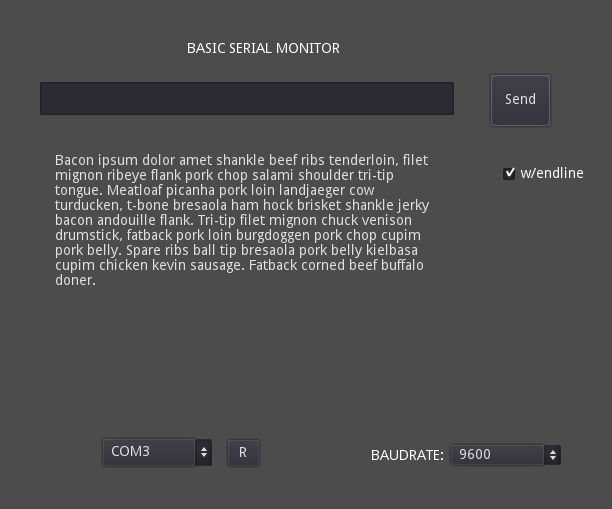

# GDSerialAsset
Asset with a serial communication example and helper functions for godot engine

**Contains:**

 - A helper script with some useful variables and simple readline(port)
   read function. 
 - A serial monitor example. 
 - DLL's for Windows 32 and 64 bits.
 - SO for linux 64 bits. (Feedback Welcome)

Note for **linux64** : You have to copy libsercomm.so to /usr/lib and run ldconfig

Serial library can be compiled from: https://github.com/Superwaitsum/GDSercomm)

An example of the monitor after sending text

**Note:** At exporting, is needed to add sercomm.dll (32 or 64 bits version) to the executable directory
